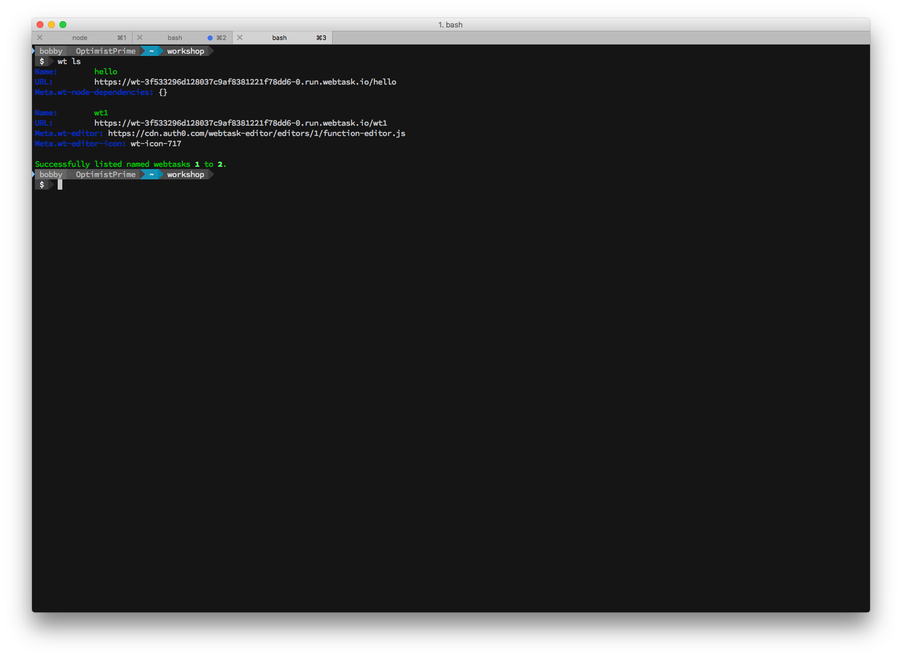
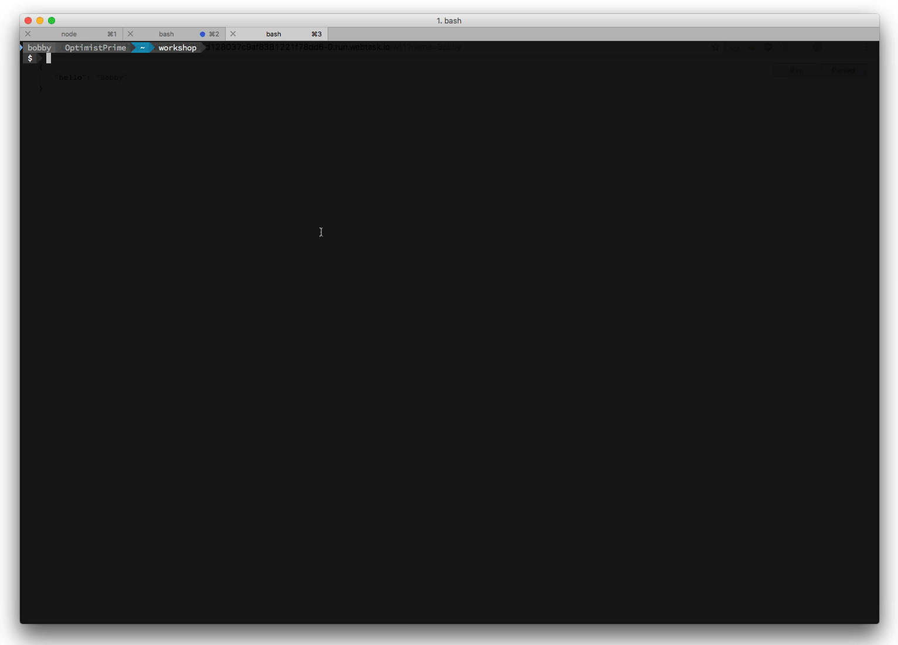
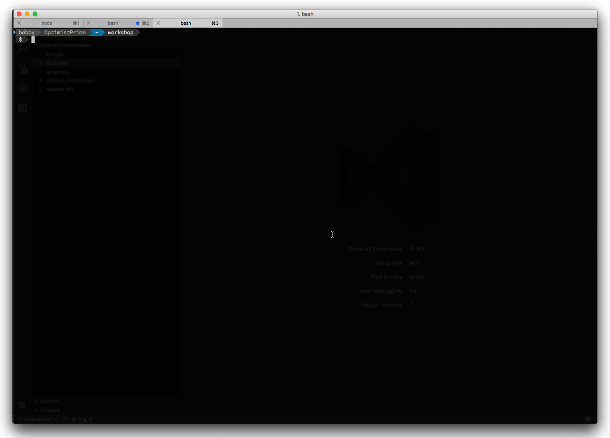
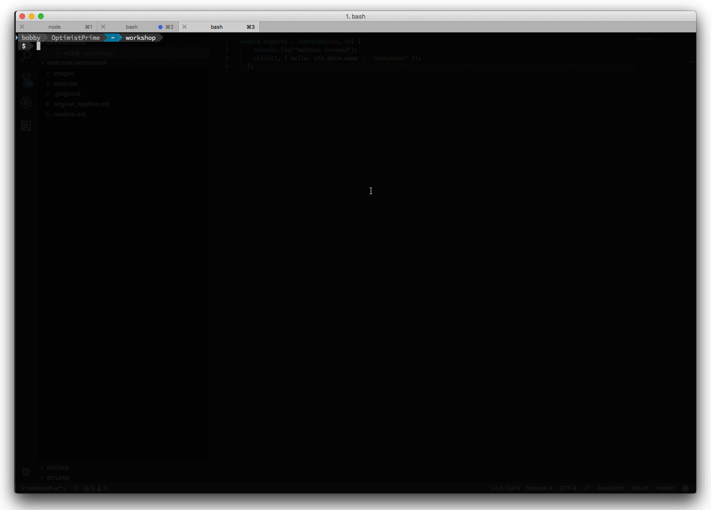
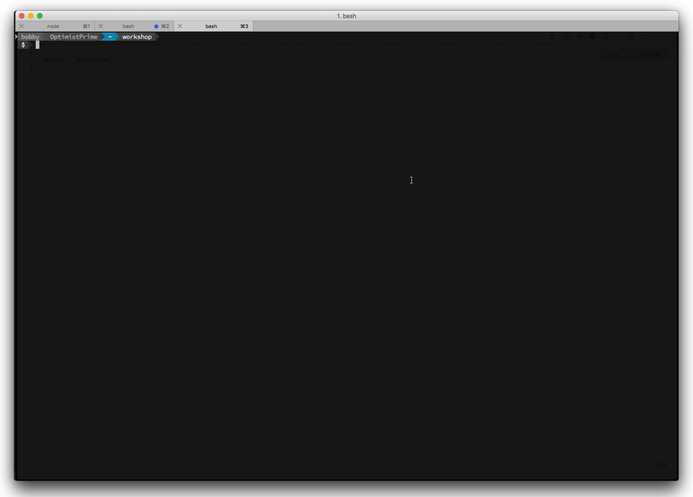

# Hello Auth0 Webtasks CLI

In the first section you authored a webtask via the browser. Auth0 Webtasks also offers wt-cli to create, edit, and manage your webtasks from the command line. One advantage of the CLI is you can create tasks using your favorite text editor / IDE and then upload them. The CLI also allows you to run tasks locally and even debug them! 

## Installing the CLI

Head over to [https//webtask.io/cli](https://webtask.io/cli) and follow the instuctions to install and test the wt-cli. You will receive a code via email which you will need to enter into the CLI in order to activate it.

### Common CLI Commands

The CLI will let you do a number of things. Here are the most common commands:

- `wt ls` - List webtasks.
- `wt create wt1.js` - Creates a new webtask based on an existing file. The prefix for the file is used as the webtask name by default. 
- `wt edit wt1` - Edits an existing webtask in the Editor. If no args are passed, then it will create a new webtask in the editor. 
- `wt mv wt1 wt2` - Renames a webtask. 
- `wt logs` - View realtime logs.
- `wt serve wt1.js` - Runs a webtask locally.
- `wt debug wt1.js` - Debugs a webtask locally.
- `wt profile` - Manage Auth0 Webtask profiles

### Using the CLI
Now you'll do some basic things with the cli.

#### List
First list out your webtasks.

```
wt ls
```

If you just created your account today, you should see 2 tasks listed, the one we created the in the browser `wt1` and the second one you created in the cli.



#### Edit
Let's edit the first one.

```
wt edit wt1
```

This should open up the editor to view your webtask.



#### Serve

Next you'll create a task locally. Using your favorite editor, let's create a new task file `wt2.js`. Put the same task that you used earlier:

```javascript
module.exports = function(ctx, cb) {
  console.log("Webhook invoked");
  cb(null, { hello: ctx.data.name || 'Anonymous' });
};
```



You can run the task locally.

```
wt serve wt2.js
```

You'll see a message indicating your task is running.

Open your browser to `localhost:8080`. You'll see your task has executed and you got back the response

```javascript
{
    hello: "Anonymous"
}
```



Hit `Ctrl-C` to stop serving the task.

#### Create

You can now upload it to the cloud.

```
wt create wt2.js
```

This will immediately create your task and share the URL.




#### Logs
Before invoking your task, you can start viewing realtime logs from the cli.

```
wt logs
```

This will output to show you that the stream is connected and waiting for output.

Now go copy the task URL and open it in the browser. 

When you do you will see the realtime logs are displayed.


## Summary


You've just installed the Auth0 Webtasks CLI seen the basics of using it to create your second and third webtask. You've then seen how to list all of your webtask in the console, bring up the web editor to edit a task, serve a task locally, create a new webtask from the console and monitor logs realtime. Wasn't that awesome? We are just getting started. 

Next, let's see how we can take advantage of node modules hosted on [NPM](npm-modules.md).