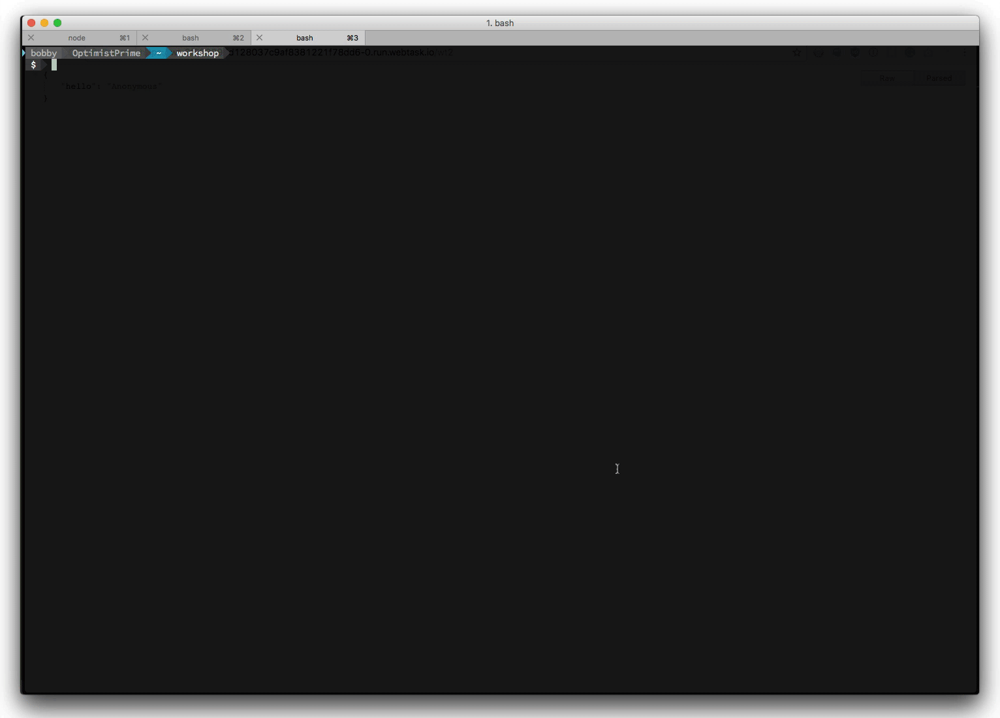
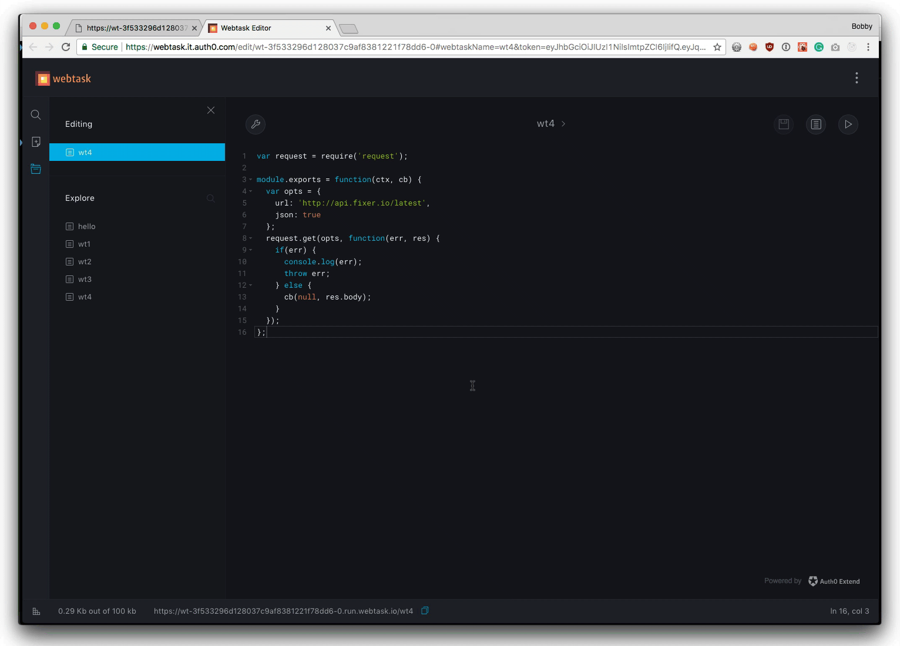
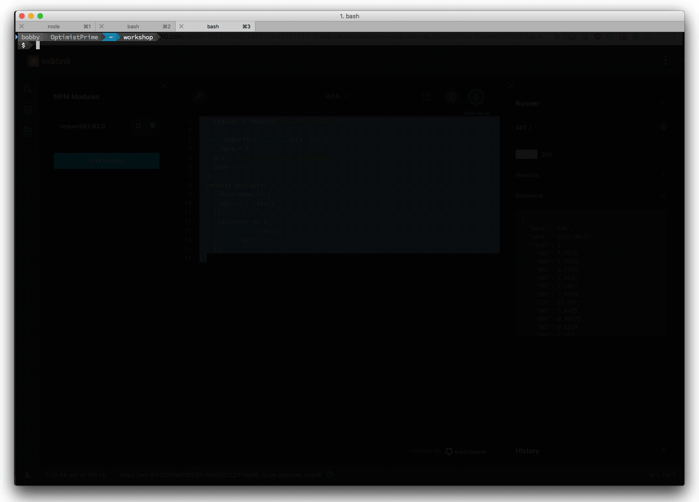
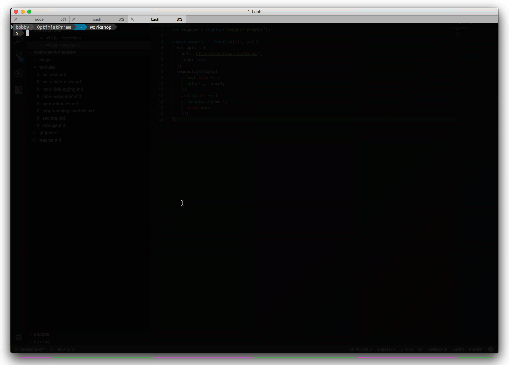

# NPM Modules

When you need to go beyond the built in node.js functionality, Auth0 Webtasks has an answer, npm modules. It offers ways to get access to node modules via editor or cli so you can enrich the capabilities of your webtasks.

## Node Modules in the Editor

Let's jump right in and create a task using the editor that depends on a module from [NPM](https://www.npmjs.com/).

- Open your browser to [https://webtask.io/make](https://webtask.io/make).
  - Alternatively, you can use `wt edit` from the command line.
- Once the editor opens, click the `Create a new one` link.
- Select `Create empty`. 
- Type `wt4` for the **name**. 
- Click `Save` button.
- Modify the webtask code with the following logic. 
- Click `Save`.

```javascript
var request = require('request');

module.exports = function(ctx, cb) {
  var opts = {
    url: 'http://api.fixer.io/latest',
    json: true
  };
  request.get(opts, function(err, res) {
    if(err) {
      console.log(err);
      throw err;
    } else {
      cb(null, res.body);      
    }
  });
};
```



This code uses the [request.js](https://github.com/request/request) module to get the latest exchange rates from the [fixer.io](http://fixer.io/) api. To get access to the request.js module we need to add it as a dependency.

- Click the `wrench` icon located in the upper left of the editor.
- Select `NPM Modules`.
- Click the `Add Module` button.
- Enter `request` into the search box.
- Select `request` from the options.
- Click `Save`.



Once saved, webtask will pull the module from NPM and make it available to your webtask for execution.

- Click on the `play` button to bring up the runner.
- Click `Run`.

You should see a list of current exchange rates in the response display.

```javascript
{
  "base": "EUR",
  "date": "2017-09-29",
  "rates": {
    "AUD": 1.5075,
    "BGN": 1.9558,
    "BRL": 3.7635,
    ...
    "SGD": 1.6031,
    "THB": 39.338,
    "TRY": 4.2013,
    "USD": 1.1806,
    "ZAR": 15.944
  }
}
```

### Specific Versions

To get a specific version of an NPM module, enter the version when searching using this format `module@version` i.e. `request@1.2.3`. In the case of multiple versions, you can specify the version in the `require` statement i.e. `require('request@1.2.3')` will pull in that specific version.


## Node Modules in the WT-CLI

You can also easily specify dependenices when using the wt-cli to `create` or `update` webtasks. Let's create a new webtask that modifies our previous example to use `request-promise`. This will require us to define two dependencies via the cli.

- Create a file named `wt5.js`.
- Using your favorite text editor, paste the following code.
- Save the file.

```javascript
var request = require('request-promise');

module.exports = function(ctx, cb) {
  var opts = {
    url: 'http://api.fixer.io/latest',
    json: true
  };
  request.get(opts)
    .then(rates => {
      cb(null, rates);    
    })
    .catch(err => {
      console.log(err);
      throw err;
    });
};

```



The `request-promise` module wraps the `request` module in [Promise](http://bluebirdjs.com/docs/why-promises.html) support. If you are not familar with promises, that is ok. We are simply using this as an example that uses two NPM modules. `request-promise` depends on `request` to work, so we need to add dependencies on both.

- Bring up your console.
- Navigate to the directory containing the `wt5.js` file.
- Execute the command `wt create wt5.js --dependency request --dependency request-promise`
- Once created, copy the webtask URL.
- Use curl to execute the task, `curl <webtask url>`.
 



This will create a new webtask with dependencies on both of our required modules. You can also specify the version of a dependency using the format mentioned previously.

## Node Modules via Package.json

When using the `wt update` command to update an existing webtask, existing dependencies will be maintaned unless you use the `--dependency` parameter. If you are, you must declare all the dependencies for the webtask. As you can imagine, that could become burdensome beyond a couple dependencies.

Luckily, the webtask cli has built in support for `package.json` files. If it finds one, it will assume all the defined dependencies are needed by the webtask and make them available.

Let's create a package.json for our wt5 webtask and then update it.

- Execute the command `npm init`.
- Accept the defaults by hitting `enter` until complete.
- Execute the command `npm install request request-promise --save`.
- Execute the command `wt update wt5 wt5.js`

This will create a package.json that looks like this:

```javascript
{
  "name": "workshop",
  "version": "1.0.0",
  "description": "",
  "main": "wt5.js",
  "scripts": {
    "test": "echo \"Error: no test specified\" && exit 1"
  },
  "author": "",
  "license": "ISC",
  "dependencies": {
    "request": "^2.83.0",
    "request-promise": "^4.2.2"
  }
}
```


Notice that the wt-cli automatically ensures the modules defined in the `package.json` are installed. Auth0 Webtasks keeps several caches of a module and all its dependencies, thus after the initial install all subsequent installs will be dramatically faster.

From a `require` standpoint, you do not specify any version when you require, if the module was specific via package.json.

If the module installation fails, then an error will be reported.

## Handling of ranges and freezing dependencies

If you are famliar with `package.json`, then you know it supports ranges for dependencies. Auth0 Webtasks will honor these ranges, but it will freeze the dependencies at the time of install. Thus subsequent updates to the task will not cause new versions of the modules to be installed. If however you modify the package.json, then new versions will get installed.


## Summary

You've just learned how to take advantage of node.js modules publically available in the NPM registry. You've seen how to add dependices via the Editor, the CLI and using a package.json. You can build some amazing things with all this power!

Next you'll learn how to define [secrets](secrets.md) that are encrypted and stored in the webtask infrastructure in the cloud.

