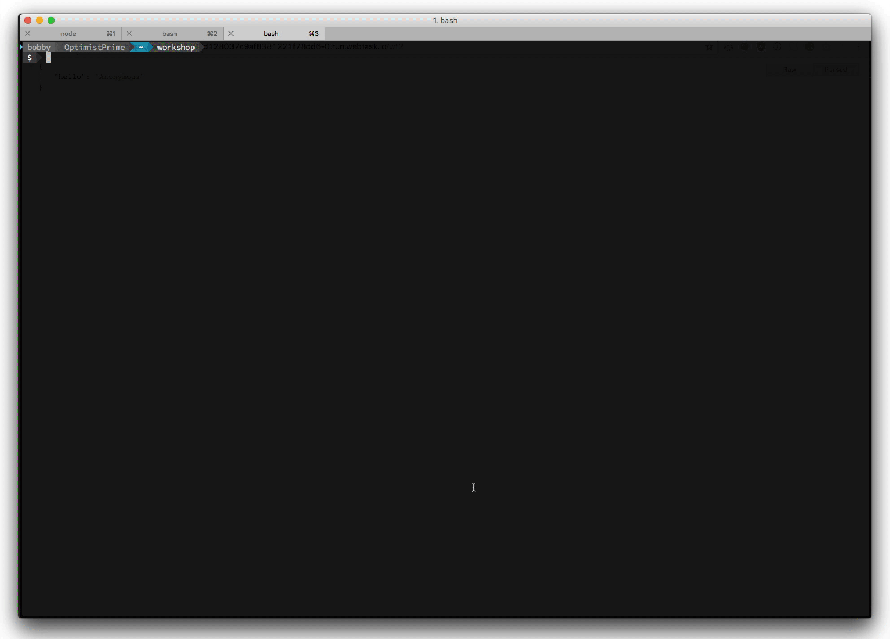
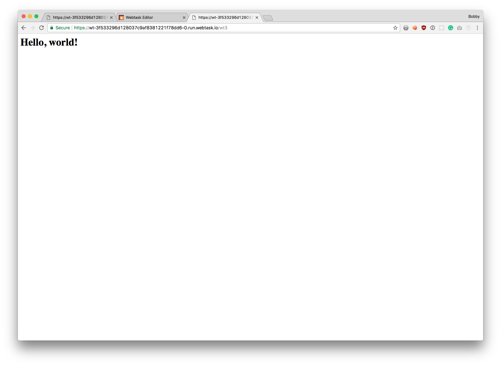

# Programming Models

Out of the box, webtasks offer three programming models. These models give you varying levels of control in your webtask.

## Simple Function

The simplest model, is just a function given a callback.

```javascript
module.exports = function(cb) {
  cb(null, "Hello World!");
};
```

If you do not require access to the context object, you can safely drop it.

## Function with Context

So far, we have been working with the second model which gives us access to the webtask context.

```javascript
module.exports = function(ctx, cb) {
  cb(null, { hello: ctx.data.name || 'Anonymous' });
};
```
In this case, we have been accessing query string values via the context's data object. In future modules we will work with other objects that are located in the context.

## Full HTTP Control

The callback object on webtask allows you to return a body, whether it be a string or a JSON payload. This is useful for many scenarios, but sometimes you want to go further. You may need to access or set headers such as content-type or cache headers, or check for an API key. 

Each webtask is an HTTP endpoint, and you can access the raw Node.js request and response objects. 

To do this, you use a different function signature for your task. 

```javascript
module.exports = function(context, req, res) {
  
}
```

* `req` and `res` are the raw Node.js request and response objects.
* `context.body` will not be populated by default. This is useful for advanced cases like chunked data. It is possible to force body to be populated.

Now you have access to the raw request. Let's see how you can return a simple HTML page.

- Open your browser to [https://webtask.io/make](https://webtask.io/make).
  - Alternatively, you can use `wt edit` from the command line.
- Once the editor opens, click the `Create a new one` link.
- This time select `Select a Template`. 
- Select the `Full HTTP control` template. 
- Type `wt3` for the **name**. 
- Click `Save` button.

This will create a task like the following:

```javascript
module.exports = function (context, req, res) {
  res.writeHead(200, { 'Content-Type': 'text/html '});
  res.end('<h1>Hello, world!</h1>');
};
```



* This task sets the Content-Type header to `text/html`.
* Returns a simple HTML response.

**Note:** Notice there is no callback object. As you have access to the raw response, you can call res.end, to end the response. 

- Copy the webtask URL to the clipboard as you did earlier.
- Now paste that into your browser.



As you can see, you now have a webtask that returns an HTML page.

## Summary

Using the raw request and response opens up a number of possiblities, you can write micro-apis, and you can return other kinds of rich content like a PDF or a graphic. You can even build `Express` tasks, something which you'll see later.

Next, let's see how we can take advantage of node modules hosted on [NPM](npm-modules.md).