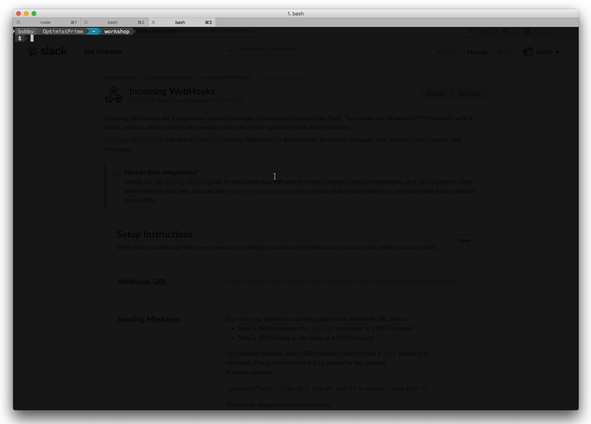

# Secrets

A very common use case for Auth0 Webtasks is to be a bridge between another service. For example, you might want to send a notification to a Slack channel whenever an issue is filed in a Github repo. Using Auth0 Webtasks provides a real easy way to handle this kind of logic. 

In order to send to Slack though, you will need to provide an SLACK URL. This URL is a secret, similar to an API key that would use to talk to a service like Twilio, or it may be connection string information to connect to a Database. Generally you don't want this kind of information sitting in the code. For one thing it is a security risk to have keys loosely exposed in text. Another is it makes the code hard to reuse and test.

Auth0 Webtasks lets you store this kind of information separately from the code in a secure manner using [Secrets](https://webtask.io/docs/editor/secrets). Each webtask can have one or more secrets with are then accessible off of the `secrets` param of the context object. Secrets are useful for more than just secure keys and connection strings, you can use them for general configuration as well.

You'll now see how you can use secrets to connecting your webtask to Slack. Before you move forward the first thing you need is an incoming Slack URL. 

- Navigate to [Incoming Webhooks](https://my.slack.com/services/new/incoming-webhook/) on Slack
- Select #general from the Post to Channel drop down
- Click the Add Incoming WebHooks integration button
- Copy the Webhook URL

 


Now you'll go store the url as a Secret in a new webtask. 

- Open your browser to [https://webtask.io/make](https://webtask.io/make).
  - Alternatively, you can use `wt edit` from the command line.
- Once the editor opens, click the `Create a new one` link.
- Select `Create empty`. 
- Type `wt6` for the **name**. 
- Click `Save` button.
- Click the `wrench` icon.
- Select `Secrets`.
- Click the `Add Secret` button.
- Enter `SLACK_URL` as the key.
- Enter the webhook URL as the value.
- Click `Save`.

 

As mentioned earlier, secrets can be accessed of the Context object using the name. To access the `SLACK_URL` you can use the code `ctx.secrets.SLACK_URL`.

To put everything together you now need to add logic to your task to send to Slack whenever there is an issue. For the actual sending to Slack you're going to take advantage of a 3rd party node module, `slack-notify`.

- Add a dependency to `slack-notify` via the NPM Modules panel.
- Modify the webtask code with the following logic.

```javascript
module.exports = function(ctx, cb) {
  var slack = require("slack-notify")(ctx.secrets.SLACK_URL);
  var body = ctx.body;
  if (body.issue && body.action === "opened") {
    var issue = body.issue;

    var text='*New Issue*\n\n' + 
             `Repository: ${body.repository.full_name}\n` +
             `Number: ${issue.number}\n` +
             `Url: ${issue.url}\n` +
             `Title: ${issue.title}\n\n` +
             `${issue.body}`;

    slack.send({text:text, username: "webtask-bot", icon_emoji: ":robot_face:"});   
  }
  cb();
};
```

Here is what this code is doing:

* Requiring the `slack-notify` module and passing the `SLACK_URL` to the constructor.
* Checking if the notification is for a new issue that has been opened.
* If it is a new issue, creating a tailored Slack Message to send to the channel.
* Sending the message.

Way back in the first module, You created a webhook on github to call our wt1 endpoint. Let's update that webhook to point to this new webtask.

- Copy the Wetask Url.
- Open [Github](https://github.com).
- Choose the repository we used before.
- Go to the `settings` page.
- Click `Webhooks`.
- Click the `Edit` button next to the previous webhook.
- For the payload URL, paste the URL of the new webtask.
- Click `Update webhook` button.

 

 - Now go create an issue in your repository. 
 


As soon as you do, you should see a Slack message similar to the following.

## Secrets in the WT-CLI

You can also easily specify secrets when using the wt-cli to `create` webtasks. Let's create a copy of the wt6 webtask using the CLI setting secrets along the way.

- Create a file named `wt7.js`.
- Using your favorite text editor, paste the Slack webtask code.
- Save the file.
- Bring up your console.
- Navigate to the directory containing the `wt6.js` file.
- Execute the command `wt create wt7.js --secret SLACK_URL=http://www.wrong.url.com`

 

The SLACK_URL is now stored as a secret. We can verify it is encrypted and view the encrypted value via the CLI as well.

- Execute the command `wt inspect wt7`

```bash
Token.ca:    [ '9007334db08c4d63a413cdaf3f3b614c', '9761877dbd364297be39936c4a3f3136' ]
Token.dd:    0
Token.dr:    1
Token.ectx:  j9uVy9yAq+K3xROJ1K7JkbE22meJ1fRt4+HgG5jjAqRCJ9spgzSFVWzfX26k6lyz.jru4i91zG5yuxg9Ig5NTAQ==
Token.iat:   1506721678
Token.jti:   061037b5ad0345df9833fd6fbaf06720
Token.jtn:   wt7
Token.mb:    1
Token.pb:    2
Token.ten:   wt-3f533296d128037c9af8381221f78dd6-0
Token.url:   webtask://localhost/api/data/code/wt-3f533296d128037c9af8381221f78dd6-0%2Fwt7
Token.webtask_url: https://wt-3f533296d128037c9af8381221f78dd6-0.run.webtask.io/wt7
Meta.wt-node-dependencies: {}
```

Secrets are stored in the `ectx` value of the webtask token. You can see here it is encrypted.

- Execute the command `wt inspect wt7 --decrypt`

```bash
Token.ca:    [ '9007334db08c4d63a413cdaf3f3b614c', '9761877dbd364297be39936c4a3f3136' ]
Token.dd:    0
Token.dr:    1
Token.ectx:  { SLACK_URL: 'http://www.wrong.url.com' }
Token.iat:   1506721678
Token.jti:   061037b5ad0345df9833fd6fbaf06720
Token.jtn:   wt7
Token.mb:    1
Token.pb:    2
Token.ten:   wt-3f533296d128037c9af8381221f78dd6-0
Token.url:   webtask://localhost/api/data/code/wt-3f533296d128037c9af8381221f78dd6-0%2Fwt7
Token.webtask_url: https://wt-3f533296d128037c9af8381221f78dd6-0.run.webtask.io/wt7
```
The secret values are clearly visiable in the console now.

### Secrets from a File

Just like node modules, dealing with more than a couple secrets can get burdensome. The `wt create` command allows you to specify a file that contains your secret values. Simply create a file and add key value pairs for your secrets to it one per line.

It should look like this:

```bash
SLACK_URL=http://www.wrong.url.com
FOO=BAR
DB_CONNECTION=sdlfkjsldkfjslkjfsdf
```

To use the file during the creation of a new webtask use the following command parameter.

```bash
wt create secret_task.js --secrets-file secrets.txt
```

**Note:** Be sure to add your secrets file to your .gitignore to ensure you don't accidentally commit it to source control.

As you can see `Secrets` are really easy to use, and they keep your code more secure and easier to maintain.

## Summary

You have just learned how to securely store sensitive information in the cloud using Secrets. They can be stored using the editor or passed along via the CLI when creating new webtasks.

Next up you will learn how to use webtask [Storage](storage.md).